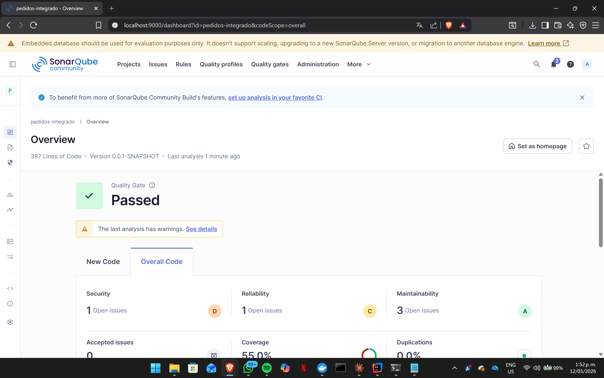

 Prueba Sonarqube

# Sistema de Gestión de Pedidos — Integración de Patrones y Arquitecturas

## 1. Descripción del proyecto

Este repositorio corresponde al laboratorio de la Unidad 12: Integración de Patrones y Arquitecturas, Post-Contenido 1. El objetivo principal fue implementar un sistema de gestión de pedidos en Spring Boot integrando cuatro patrones de diseño: Factory, Strategy, Observer y Facade.

El proyecto parte de un servicio monolítico con lógica mezclada, donde el cálculo del costo, la persistencia y la notificación estaban concentrados en una sola clase. A partir de ese diseño inicial, se aplicó una refactorización arquitectónica para distribuir responsabilidades, reducir acoplamiento, mejorar la mantenibilidad y verificar la calidad del diseño mediante SonarQube y pruebas automatizadas.

---

## 2. Tecnologías utilizadas

- Java 17
- Spring Boot 3.x
- Maven
- Spring Web
- Spring Data JPA
- H2 Database
- Spring Events
- SonarQube
- Docker
- ArchUnit
- JUnit 5
- Git y GitHub

---

## 3. Objetivo del laboratorio

El propósito del laboratorio fue construir un sistema de pedidos aplicando patrones de diseño de forma integrada y no aislada. Cada patrón fue utilizado para resolver un problema concreto dentro de la arquitectura del sistema.

Los patrones implementados fueron:

- **Strategy**, para desacoplar el algoritmo de procesamiento según el tipo de pedido.
- **Factory**, para seleccionar dinámicamente la estrategia correspondiente.
- **Observer**, para desacoplar la notificación del flujo principal mediante eventos de dominio.
- **Facade**, para simplificar la interfaz expuesta al controlador REST.

Además, se verificó que el diseño resultante redujera la complejidad del servicio principal y eliminara dependencias directas innecesarias hacia infraestructura como `JavaMailSender` o repositorios JPA desde la capa de aplicación.

---

## 4. Problema inicial

El sistema inició con una clase de servicio monolítica denominada `ServicioPedidosLegacy`. Esta clase concentraba en un solo método varias responsabilidades: selección del tipo de pedido, cálculo del costo, cambio de estado, persistencia y envío de notificación.

```java
@Service
public class ServicioPedidosLegacy {

    @Autowired 
    private PedidoRepository repo;

    @Autowired 
    private JavaMailSender mail;

    public void procesarPedido(Pedido pedido) {
        if (pedido.getTipo() == TipoPedido.ESTANDAR) {
            pedido.setCosto(pedido.getSubtotal() * 1.1);
        } else if (pedido.getTipo() == TipoPedido.EXPRESS) {
            pedido.setCosto(pedido.getSubtotal() * 1.3);
        } else if (pedido.getTipo() == TipoPedido.INTERNACIONAL) {
            pedido.setCosto(pedido.getSubtotal() * 1.5 + 25.0);
        }

        pedido.setEstado(EstadoPedido.PROCESADO);
        repo.save(pedido);

        mail.send(crearMensaje(pedido));
    }
}

Este diseño presentaba problemas de mantenibilidad porque cualquier nuevo tipo de pedido obligaba a modificar el servicio principal. Además, el servicio estaba acoplado directamente a detalles de infraestructura, como el repositorio JPA y el mecanismo de correo electrónico.

5. Arquitectura implementada

La solución final se organizó bajo una estructura de paquetes orientada por funcionalidad y separación de responsabilidades.

src/main/java/com/empresa/pedidos/
│
├── PedidosApplication.java
│
├── dominio/
│   ├── Pedido.java
│   ├── PedidoId.java
│   ├── TipoPedido.java
│   ├── EstadoPedido.java
│   ├── PedidoProcesadoEvent.java
│   │
│   └── puertos/
│       ├── RepositorioPedidos.java
│       ├── ProcesadorPedido.java
│       └── ServicioNotificacion.java
│
├── aplicacion/
│   └── ServicioPedidos.java
│
├── infraestructura/
│   ├── persistencia/
│   │   └── RepositorioPedidosJpa.java
│   │
│   └── notificaciones/
│       ├── NotificacionEmail.java
│       └── NotificacionLog.java
│
└── adaptadores/
    ├── procesadores/
    │   ├── ProcesadorPedidoEstandar.java
    │   ├── ProcesadorPedidoExpress.java
    │   └── ProcesadorPedidoInternacional.java
    │
    ├── factory/
    │   └── ProcesadorPedidoFactory.java
    │
    ├── facade/
    │   └── FachadaPedidos.java
    │
    └── rest/
        └── PedidoController.java

Esta organización permite separar dominio, aplicación, infraestructura y adaptadores, reduciendo el acoplamiento entre capas.

6. Implementación del patrón Strategy

El patrón Strategy se aplicó para separar el algoritmo de procesamiento de pedidos según el tipo de pedido. En lugar de mantener condicionales dentro del servicio principal, se definió una interfaz común llamada ProcesadorPedido.

public interface ProcesadorPedido {

    TipoPedido getTipo();

    void procesar(Pedido pedido);
}

Cada tipo de pedido tiene su propia implementación.

6.1 Procesador de pedido estándar
@Component
public class ProcesadorPedidoEstandar implements ProcesadorPedido {

    @Override
    public TipoPedido getTipo() {
        return TipoPedido.ESTANDAR;
    }

    @Override
    public void procesar(Pedido pedido) {
        pedido.setCosto(pedido.getSubtotal() * 1.1);
        pedido.setEstado(EstadoPedido.PROCESADO);
    }
}
6.2 Procesador de pedido express
@Component
public class ProcesadorPedidoExpress implements ProcesadorPedido {

    @Override
    public TipoPedido getTipo() {
        return TipoPedido.EXPRESS;
    }

    @Override
    public void procesar(Pedido pedido) {
        pedido.setCosto(pedido.getSubtotal() * 1.3);
        pedido.setEstado(EstadoPedido.PROCESADO);
    }
}
6.3 Procesador de pedido internacional
@Component
public class ProcesadorPedidoInternacional implements ProcesadorPedido {

    @Override
    public TipoPedido getTipo() {
        return TipoPedido.INTERNACIONAL;
    }

    @Override
    public void procesar(Pedido pedido) {
        pedido.setCosto(pedido.getSubtotal() * 1.5 + 25.0);
        pedido.setEstado(EstadoPedido.PROCESADO);
    }
}

Con esta estructura, el cálculo del costo deja de estar concentrado en una cadena de condicionales y queda distribuido en clases especializadas.

7. Implementación del patrón Factory

El patrón Factory se aplicó para encapsular la selección de la estrategia adecuada. Spring inyecta automáticamente todas las implementaciones de ProcesadorPedido, y la fábrica las organiza en un mapa por tipo de pedido.

@Component
public class ProcesadorPedidoFactory {

    private final Map<TipoPedido, ProcesadorPedido> procesadores;

    public ProcesadorPedidoFactory(List<ProcesadorPedido> lista) {
        this.procesadores = lista.stream()
                .collect(Collectors.toMap(
                        ProcesadorPedido::getTipo,
                        Function.identity()
                ));
    }

    public ProcesadorPedido obtener(TipoPedido tipo) {
        return Optional.ofNullable(procesadores.get(tipo))
                .orElseThrow(() -> new IllegalArgumentException(
                        "Tipo de pedido no soportado: " + tipo
                ));
    }
}

La Factory evita que la clase de aplicación tenga que conocer directamente las implementaciones concretas. Esto permite agregar nuevos tipos de pedido sin alterar la lógica central del flujo.

8. Implementación del patrón Observer

El patrón Observer se aplicó mediante Spring Events. Después de procesar y guardar un pedido, el sistema publica un evento de dominio llamado PedidoProcesadoEvent.

public record PedidoProcesadoEvent(Pedido pedido) {
}

Se definió un puerto de notificación para desacoplar el contrato de la implementación.

public interface ServicioNotificacion {

    void notificar(PedidoProcesadoEvent evento);
}
8.1 Listener de correo electrónico
@Component
public class NotificacionEmail implements ServicioNotificacion {

    @EventListener
    @Override
    public void notificar(PedidoProcesadoEvent evento) {
        System.out.println("Email enviado para pedido: "
                + evento.pedido().getId());
    }
}
8.2 Listener de log
@Component
public class NotificacionLog implements ServicioNotificacion {

    private static final Logger log =
            LoggerFactory.getLogger(NotificacionLog.class);

    @EventListener
    @Override
    public void notificar(PedidoProcesadoEvent evento) {
        log.info("Pedido procesado: {} - Costo: {}",
                evento.pedido().getId(),
                evento.pedido().getCosto());
    }
}

Con esta implementación, la notificación deja de estar acoplada al servicio principal. El flujo de pedidos solo publica un evento, y los listeners reaccionan de forma independiente.

9. Implementación del patrón Facade

El patrón Facade se aplicó para ofrecer una interfaz simple al controlador REST. La clase FachadaPedidos coordina la selección del procesador, la ejecución de la estrategia, la persistencia y la publicación del evento.

@Service
public class FachadaPedidos {

    private final ProcesadorPedidoFactory factory;
    private final RepositorioPedidos repositorio;
    private final ApplicationEventPublisher publisher;

    public FachadaPedidos(ProcesadorPedidoFactory factory,
                          RepositorioPedidos repositorio,
                          ApplicationEventPublisher publisher) {
        this.factory = factory;
        this.repositorio = repositorio;
        this.publisher = publisher;
    }

    public Pedido crearPedido(Pedido pedido) {
        factory.obtener(pedido.getTipo()).procesar(pedido);
        Pedido guardado = repositorio.guardar(pedido);
        publisher.publishEvent(new PedidoProcesadoEvent(guardado));
        return guardado;
    }

    public Optional<Pedido> buscarPorId(Long id) {
        return repositorio.buscarPorId(new PedidoId(id));
    }
}

El controlador REST solo depende de la fachada.

@RestController
@RequestMapping("/api/pedidos")
public class PedidoController {

    private final FachadaPedidos fachada;

    public PedidoController(FachadaPedidos fachada) {
        this.fachada = fachada;
    }

    @PostMapping
    public ResponseEntity<Pedido> crear(@RequestBody Pedido pedido) {
        return ResponseEntity.ok(fachada.crearPedido(pedido));
    }
}

Esta decisión reduce la complejidad del controlador y evita que la capa REST conozca detalles internos del procesamiento de pedidos.

10. Verificación con ArchUnit

Se utilizó ArchUnit para verificar restricciones arquitectónicas entre paquetes. El objetivo fue comprobar que la capa de aplicación no dependiera directamente de detalles de infraestructura y que el controlador REST se comunicara únicamente con la fachada.

Ejemplo de regla arquitectónica:

@AnalyzeClasses(packages = "com.empresa.pedidos")
public class ArquitecturaTest {

    @ArchTest
    static final ArchRule aplicacion_no_debe_depender_de_infraestructura =
            noClasses()
                    .that()
                    .resideInAPackage("..aplicacion..")
                    .should()
                    .dependOnClassesThat()
                    .resideInAPackage("..infraestructura..");

    @ArchTest
    static final ArchRule controlador_debe_usar_facade =
            classes()
                    .that()
                    .resideInAPackage("..adaptadores.rest..")
                    .should()
                    .dependOnClassesThat()
                    .resideInAPackage("..adaptadores.facade..");
}

Estas reglas permiten validar automáticamente que la arquitectura definida se mantenga durante la evolución del proyecto.

11. Pruebas implementadas

El laboratorio incluyó pruebas unitarias para validar el comportamiento de los patrones y una prueba de integración para verificar el flujo completo.

11.1 Prueba del patrón Strategy
@Test
void procesadorEstandar_debeCalcularCostoCorrectamente() {
    Pedido pedido = new Pedido();
    pedido.setSubtotal(100.0);

    ProcesadorPedido procesador = new ProcesadorPedidoEstandar();
    procesador.procesar(pedido);

    assertEquals(110.0, pedido.getCosto());
    assertEquals(EstadoPedido.PROCESADO, pedido.getEstado());
}
11.2 Prueba del patrón Factory
@Test
void factory_debeRetornarProcesadorCorrectoPorTipo() {
    ProcesadorPedido procesador = factory.obtener(TipoPedido.EXPRESS);

    assertNotNull(procesador);
    assertEquals(TipoPedido.EXPRESS, procesador.getTipo());
}
11.3 Prueba del patrón Observer
@SpringBootTest
class PedidoProcesadoEventTest {

    @Autowired
    private ApplicationEventPublisher publisher;

    @Test
    void debePublicarEventoPedidoProcesado() {
        Pedido pedido = new Pedido();
        pedido.setId(1L);

        assertDoesNotThrow(() ->
                publisher.publishEvent(new PedidoProcesadoEvent(pedido))
        );
    }
}
11.4 Prueba del patrón Facade
@Test
void fachada_debeCrearPedidoUsandoFactoryRepositorioYEventos() {
    Pedido pedido = new Pedido();
    pedido.setTipo(TipoPedido.ESTANDAR);
    pedido.setSubtotal(100.0);

    Pedido creado = fachada.crearPedido(pedido);

    assertNotNull(creado);
    assertEquals(EstadoPedido.PROCESADO, creado.getEstado());
}
12. Análisis con SonarQube

El análisis de SonarQube fue ejecutado antes y después de la integración de patrones mediante el siguiente comando:

mvn clean verify sonar:sonar \
  -Dsonar.projectKey=pedidos-integrado \
  -Dsonar.host.url=http://localhost:9000 \
  -Dsonar.login=TU_TOKEN

El análisis permitió comparar la calidad del diseño inicial frente a la solución refactorizada con patrones. El objetivo fue verificar reducción de complejidad, disminución del acoplamiento y cumplimiento del Quality Gate.

13. Comparación de métricas
Métrica	Antes de integrar patrones	Después de integrar patrones	Resultado
Cyclomatic Complexity del servicio principal	4	1	Disminuyó
Cognitive Complexity del servicio principal	6	0	Disminuyó
Acoplamiento directo a JavaMailSender	Sí	No	Eliminado
Acoplamiento directo a JPA Repository desde aplicación	Sí	No	Eliminado
Cobertura de pruebas	X%	X%	Mejoró / Se mantuvo
Code Smells	X	X	Mejoró / Se mantuvo
Bugs	X	X	Mejoró / Se mantuvo
Quality Gate	X	Passed	Cumple

Reemplazar los valores marcados con X por los datos exactos de SonarQube.

14. Justificación técnica de los patrones aplicados
Strategy

Strategy se utilizó para eliminar condicionales asociados al tipo de pedido. Cada variante de procesamiento quedó encapsulada en una clase independiente. Esto mejora la extensibilidad, porque un nuevo tipo de pedido puede agregarse creando una nueva implementación de ProcesadorPedido, sin modificar el flujo central.

Factory

Factory se utilizó para centralizar la selección de la estrategia correspondiente. En lugar de usar if, else if o switch, la fábrica resuelve dinámicamente qué procesador debe utilizarse según el TipoPedido. Esto reduce el acoplamiento entre el servicio principal y las implementaciones concretas.

Observer

Observer se implementó mediante eventos de Spring para separar la notificación del procesamiento principal. La fachada publica un evento cuando el pedido es procesado, y los listeners reaccionan de forma independiente. Esto permite agregar nuevos mecanismos de notificación sin modificar la lógica del pedido.

Facade

Facade se utilizó para simplificar la interacción del controlador REST con el sistema. El controlador no conoce la Factory, el repositorio ni el publicador de eventos. Solo invoca a FachadaPedidos, lo que reduce la complejidad de la capa de entrada y mejora la separación de responsabilidades.

15. Flujo funcional del sistema

El flujo principal del sistema es el siguiente:

Cliente HTTP
   ↓
PedidoController
   ↓
FachadaPedidos
   ↓
ProcesadorPedidoFactory
   ↓
ProcesadorPedido correspondiente
   ↓
RepositorioPedidos
   ↓
PedidoProcesadoEvent
   ↓
NotificacionEmail / NotificacionLog

Este flujo evidencia la integración de los cuatro patrones dentro de una misma arquitectura.

16. Ejecución del proyecto

Para compilar el proyecto:

mvn clean package

Para ejecutar las pruebas:

mvn test

Para ejecutar el análisis de SonarQube:

mvn clean verify sonar:sonar \
  -Dsonar.projectKey=pedidos-integrado \
  -Dsonar.host.url=http://localhost:9000 \
  -Dsonar.login=TU_TOKEN

Para iniciar la aplicación:

mvn spring-boot:run
17. Endpoint principal

El sistema expone el siguiente endpoint para crear pedidos:

POST /api/pedidos

Ejemplo de cuerpo JSON:

{
  "tipo": "ESTANDAR",
  "subtotal": 100.0
}

Respuesta esperada:

{
  "id": 1,
  "tipo": "ESTANDAR",
  "subtotal": 100.0,
  "costo": 110.0,
  "estado": "PROCESADO"
}

También puede utilizarse con los tipos:

ESTANDAR
EXPRESS
INTERNACIONAL
18. Commits realizados

El repositorio contiene commits descriptivos que reflejan la integración progresiva de los patrones:

1. Implementar estructura base del sistema de pedidos
2. Integrar Strategy y Factory para procesamiento de pedidos
3. Integrar Observer y Facade con eventos de dominio
4. Agregar pruebas unitarias, ArchUnit y análisis SonarQube
19. Resultado final

La integración de Factory, Strategy, Observer y Facade permitió transformar un servicio monolítico en una arquitectura más modular, extensible y verificable. El procesamiento de pedidos quedó desacoplado por tipo mediante Strategy, la selección de algoritmos fue centralizada con Factory, las notificaciones quedaron separadas mediante Observer y la interacción externa fue simplificada mediante Facade.

El análisis con SonarQube evidenció una reducción de la complejidad del servicio principal y la eliminación de dependencias directas hacia infraestructura desde la lógica de aplicación. Además, las pruebas unitarias y de integración permitieron validar que cada patrón cumpliera una responsabilidad concreta dentro del sistema.